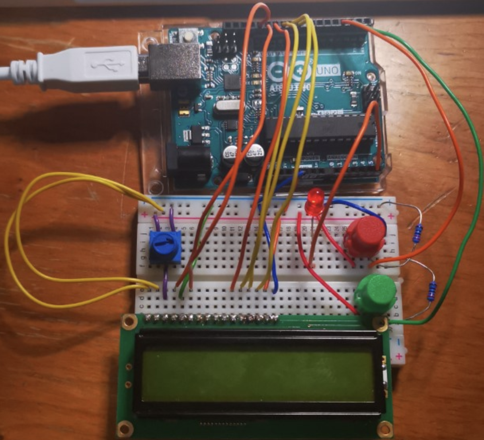

# Mini-Project for B31DD
#### Author: Yifei Jing H00263865
#### mail: yj10@hw.ac.uk

------
# Abstract

**This project is an implementation on flappy bird game.**
All of the work has been completed on *macOS 10.14* using an environment provided by *CrossPack-AVR*. The compilation on other platforms should also be available through the avr toolchain.

-----
# Compile

To compile and flash the hex file on your board. First make sure the path to the avr tools (*avr-gcc, avr-objcopy, avrdude, etc.*) have been added to the environment. Or you need to edit the definitions in **Makefile** located at the root directory. Put your path to the tool at the right side of the expression like below:

`CC = /usr/local/CrossPack-AVR/bin/avr-gcc`

Then, edit the port of your device:

`PROGRAMMER_ARGS = -P yourPortName`

To compile, run:

`make all`

To flash to the board (also contains the process of compilation, if it has not been compiled):

`make flash`

------
# Cricuit
The configurations of the board are included in the **pinout.h** at the root directory. Make sure your circuit has been connected according to the definitions in this file, or you can simplely edit it to adapt to your condition.
A sample connection is provided below:

-----
# Descriptions
The compendium of each file will be listed below:

Directory|File Name|Description
--|:--:|--
.|main.c|The entry of the program. Contains `main()` function
.|pinout.h|Definition of the use of ports of the chip
src|flappybird.c|The logics of the game
src|graphics.c|The implementation of functions to draw on the lcd
src|lcd.c|The low-level configuration functions implementation
src|utils.c|Configurations of the peripherals on the chip
include|flappybird.h|Exposed APIs and data structures of the game
include|graphic.h|APIs of drawing on lcd
include|lcd.h|low-level APIs to configure the lcd
include|types.h|Types defined for software layer
include|utils.h|APIs to interact with peripherals on the chip
output|*|All of the files in this directory are outputs of the compiling tools, they can be ignored